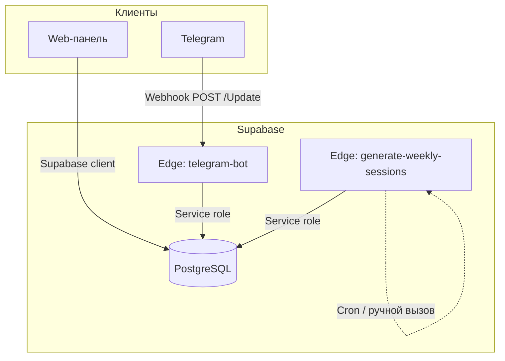
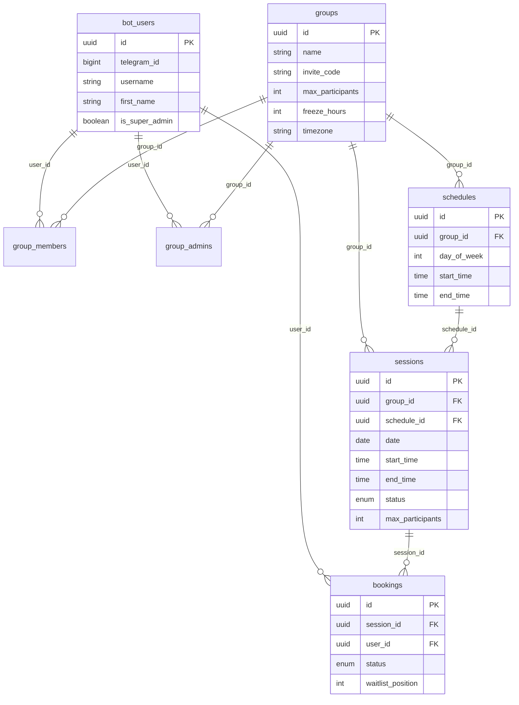
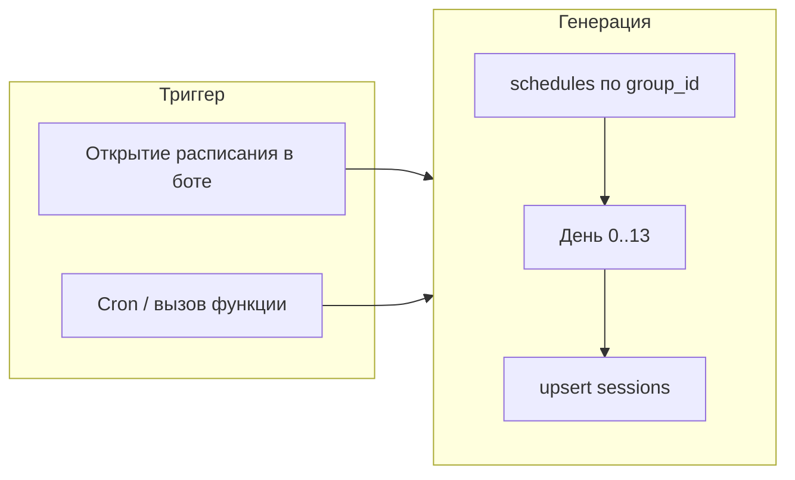

# Rally Buddy — архитектура

## Общая схема компонентов



## Потоки данных

```mermaid
flowchart LR
    subgraph input["Ввод"]
        U[Пользователь]
    end

    subgraph bot["Telegram Bot"]
        H[handleUpdate]
        START[/start, join]
        MENU[Меню]
        Sched[Расписание]
        Book[Запись/отмена]
        Admin[Админка]
    end

    subgraph data["Данные"]
        UU[bot_users]
        G[groups]
        GM[group_members]
        GA[group_admins]
        SCH[schedules]
        S[sessions]
        B[bookings]
    end

    U --> H
    H --> START --> MENU
    MENU --> Sched
    MENU --> Book
    MENU --> Admin
    H --> UU
    H --> G
    H --> GM
    H --> GA
    Sched --> SCH
    Sched --> S
    Book --> B
```

## Слой базы данных (основные сущности)



## Сценарий: запись на тренировку

```mermaid
sequenceDiagram
    participant U as Пользователь
    participant TG as Telegram
    participant Bot as telegram-bot
    participant DB as PostgreSQL

    U->>TG: Нажимает "Записаться"
    TG->>Bot: callback_query book_&lt;sessionId&gt;
    Bot->>DB: getOrCreateUser, session, membership
    Bot->>Bot: freeze_hours? banned?
    Bot->>DB: count active bookings
    alt Есть место
        Bot->>DB: insert booking status=active
        Bot->>TG: "Вы записаны"
    else Нет места
        Bot->>DB: insert booking status=waitlist
        Bot->>TG: "Вы в очереди"
    end
```

## Сценарий: отмена и продвижение из очереди

```mermaid
sequenceDiagram
    participant U as Пользователь
    participant Bot as telegram-bot
    participant DB as PostgreSQL
    participant U2 as Участник из очереди

    U->>Bot: confirm_cancel_&lt;sessionId&gt;
    Bot->>DB: update booking → cancelled
    Bot->>DB: select first waitlist
    alt Есть в очереди
        Bot->>DB: update waitlist → active
        Bot->>U2: sendMessage "Место освободилось!"
    end
    Bot->>U: "Запись отменена"
```

## Генерация сессий


